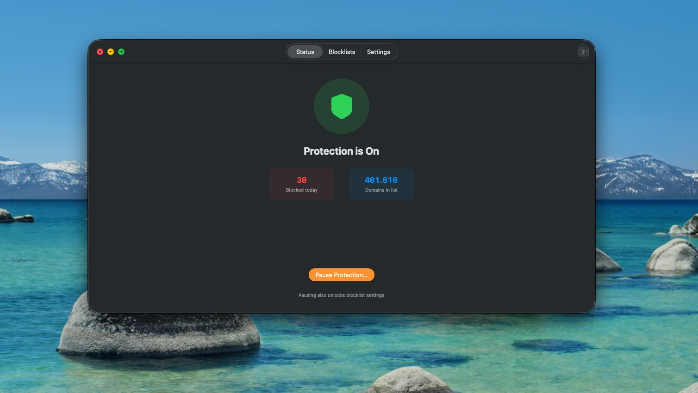
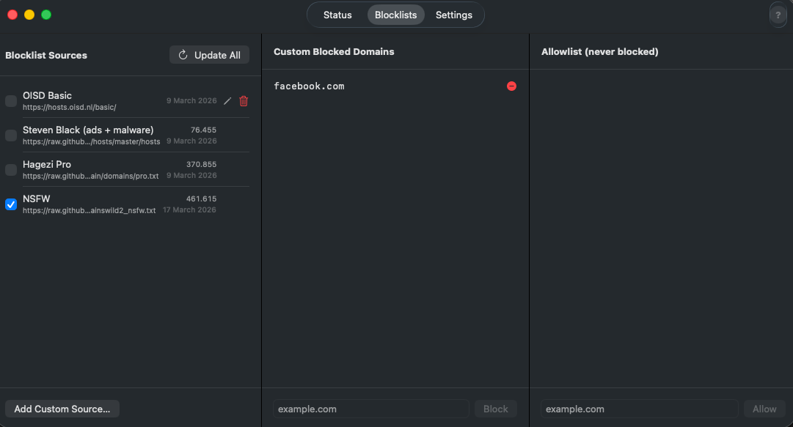

# SafeBrowse

A macOS menu-bar app that blocks unsafe domains at the OS level using public blocklists.
Blocking is done via a local DNS proxy on port 53 — no network extension entitlements required.

## How it works

```
SafeBrowse.app  (menu bar, user space)
       │  Unix socket: /var/run/safebrowse.sock
       ▼
safebrowse-helper  (LaunchDaemon, root)
       │  listens on 127.0.0.1:53
       ▼
System DNS → 127.0.0.1 → proxy → blocklist check → 1.1.1.1 (upstream)
```

Blocked domains receive an **NXDOMAIN** response.
Allowing/blocking only changes a flag in the proxy — system DNS stays pointed at `127.0.0.1` throughout.

## Demo images




---

## Installation

> **Note:** SafeBrowse is unsigned. macOS will quarantine it on first download.
> The steps below handle this automatically.

### 1. Download the latest release

Go to the [Releases](../../releases/latest) page and download `SafeBrowse-<version>.zip`.

### 2. Unzip

Double-click the zip, or in Terminal:

```bash
unzip SafeBrowse-1.0.zip
cd SafeBrowse-1.0
```

### 3. Strip the quarantine flag

macOS Gatekeeper blocks unsigned apps downloaded from the internet. Remove the quarantine attribute before installing:

```bash
sudo xattr -cr SafeBrowse.app
```

### 4. Move the app to /Applications

```bash
cp -R SafeBrowse.app /Applications/
```

### 5. Install the helper daemon

The helper runs as a privileged LaunchDaemon and handles all DNS proxying. Install it once:

```bash
sudo ./install.sh /Applications/SafeBrowse.app
```

This:
1. Copies `safebrowse-helper` to `/usr/local/bin/`
2. Installs a LaunchDaemon (`com.safebrowse.helper`) — starts on boot, restarts on crash
3. Installs a LaunchAgent (`com.safebrowse.app`) — auto-launches the app on login
4. Sets system DNS to `127.0.0.1` (restored on uninstall)

### 6. Open SafeBrowse

SafeBrowse will launch automatically. You'll see the shield icon in the menu bar.

---

## Uninstall

```bash
sudo ./uninstall.sh
```

Removes the daemon, agent, helper binary, and restores system DNS.

---

## Usage

1. Click the shield icon in the menu bar to see status and quick controls
2. Open the main window to manage blocklists and update them
3. **Settings tab** — set a password to protect the Pause and Quit functions
4. **Pause Protection…** — temporarily bypass blocking for a set duration (requires password)

## Built-in blocklists

| Name | ~Domains | Enabled by default |
|------|----------|--------------------|
| OISD Basic | 50 k | ✓ |
| Steven Black (ads + malware) | 250 k | ✓ |
| Hagezi Pro | 400 k | — |
| NSFW | 100 k | — |

Custom blocklist URLs (hosts format or plain domain list) can be added in the app.

---

## Build from source

### Requirements

- macOS 13 (Ventura) or later
- Xcode 15+
- [XcodeGen](https://github.com/yonaskolb/XcodeGen): `brew install xcodegen`

### Build

```bash
cd SafeBrowse
xcodegen generate          # creates SafeBrowse.xcodeproj
open SafeBrowse.xcodeproj
# Product → Build (⌘B)
```

### Package a release

```bash
# In Xcode: Product → Export → Built Products → choose export folder
./package.sh '/path/to/SafeBrowse 2026-03-17 17-15-42'
# Outputs: SafeBrowse-<version>.zip
```

---

## Files

```
SafeBrowse/
├── Shared/              ← Shared types (socket protocol)
├── SafeBrowseHelper/    ← Privileged daemon source
├── SafeBrowse/          ← Menu-bar app source
├── project.yml          ← XcodeGen project spec
├── install.sh           ← sudo installer
├── uninstall.sh         ← sudo uninstaller
└── package.sh           ← release bundler
```

## Diagnostics

```bash
# Is the helper running?
pgrep safebrowse-helper

# Test DNS proxy directly
dig @127.0.0.1 google.com          # should resolve
dig @127.0.0.1 doubleclick.net     # should return NXDOMAIN (if blocklist is loaded)

# Check system DNS
scutil --dns | grep nameserver

# View helper logs
tail -f /var/log/safebrowse-helper.log
```
